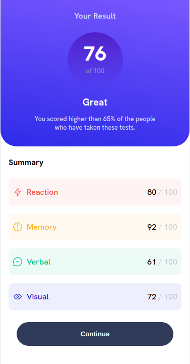

# Frontend Mentor - Results summary component solution

This is a solution to the [Results summary component challenge on Frontend Mentor](https://www.frontendmentor.io/challenges/results-summary-component-CE_K6s0maV). Frontend Mentor challenges help you improve your coding skills by building realistic projects. 

### Screenshot

## Instructions

* Install nodejs
* Install http-server using `npm install -g http-server`
* Run `http-server` from the command line
* Open the local server at https://localhost:8080

## Author

- Frontend Mentor - [@arielberardi](https://www.frontendmentor.io/profile/arielberardi)
